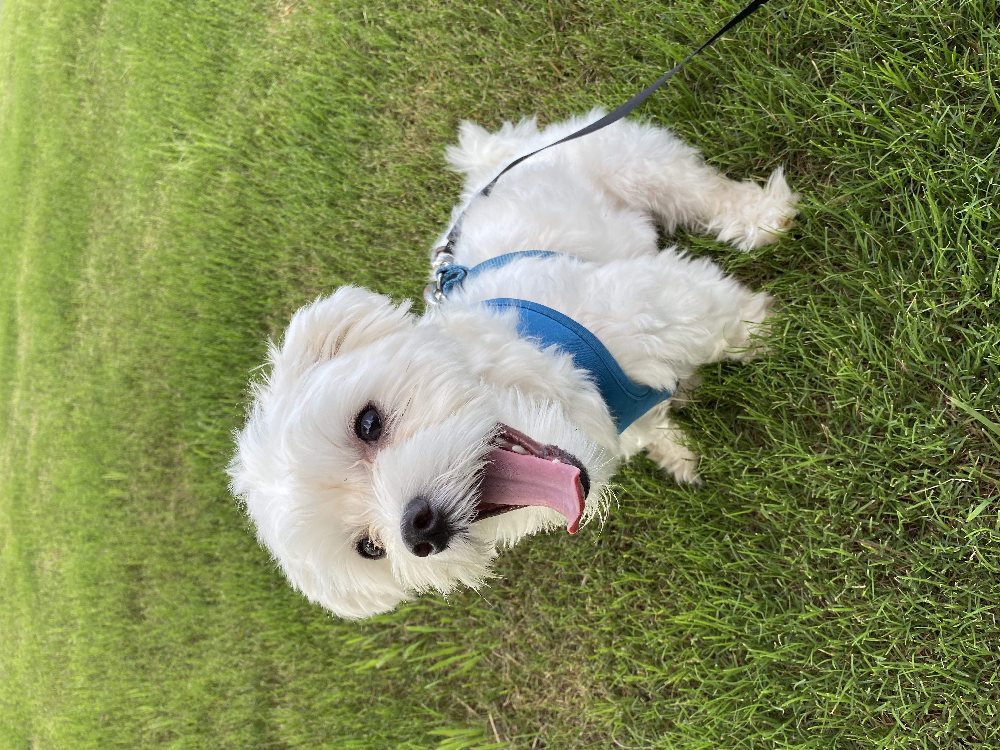

# Hello, World 😀

I'm a Data Enthusiast at MAP Communications, Inc in Virginia. I stumble into coding ever so often. I studied Computer Science at Tidewater Community College and Old Dominion University.

I love traveling, reading, taking photos, and musicals (Bollywood Buff). My resume is available if you want to be all formal and the usual stuff ⬇

This is where I work (MAP Communications, Inc)[https://www.mapcommunications.com]

Hoc est leo

